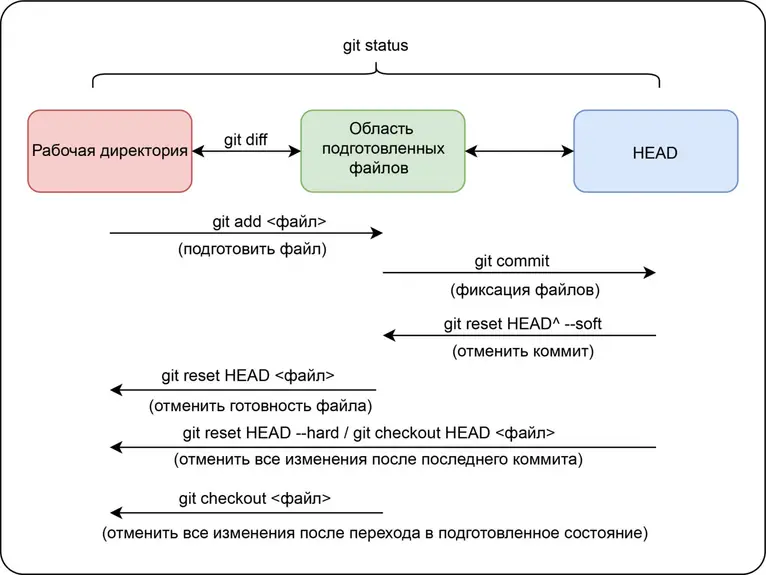

[< К содержанию](/README.md)

# Файловая система GIT

 **Существует 3 основных раздела**:

* `Рабочая директория` (файловая система вашего компьютера);  
* `Область подготовленных файлов` (*staging area*, хранит содержание следующего коммита);  
* `HEAD` (последний коммит в репозитории).

    

  

Все основные команды по работе с файлами сводятся к пониманию того, как Git управляет этими тремя разделами.   
Существует распространённое заблуждение, что область подготовленных файлов только хранит изменения. Лучше думать об этих трёх разделах как об отдельных файловых системах, каждая из которых содержит свои копии файлов.

